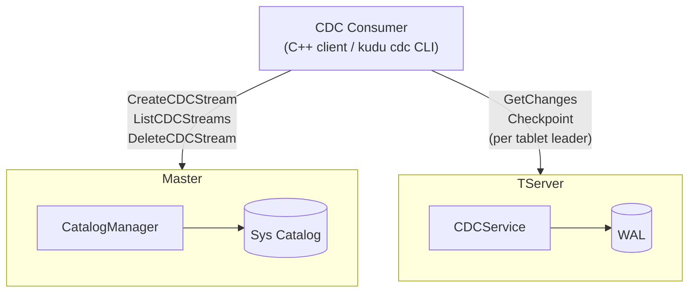
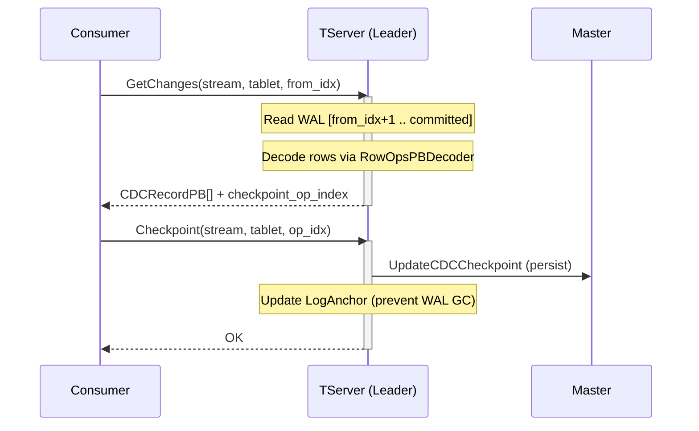
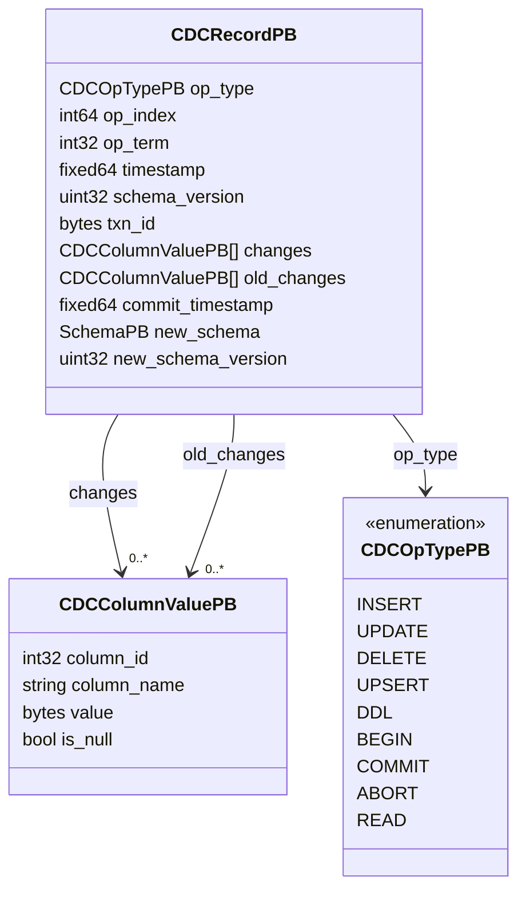
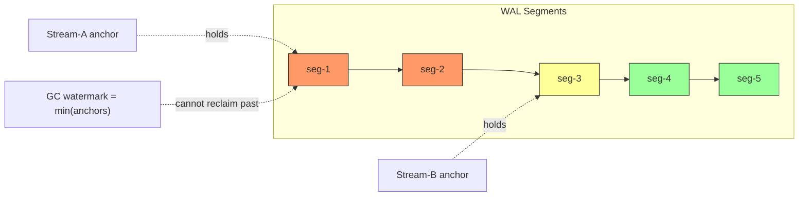
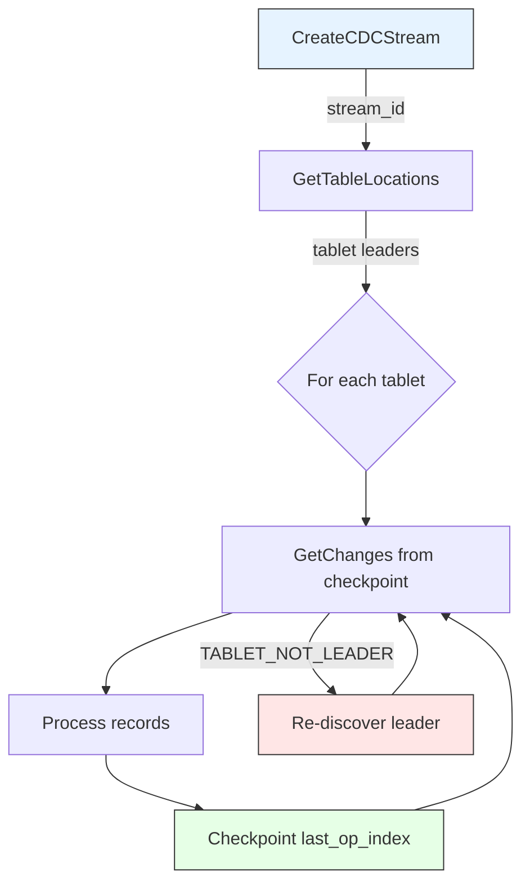

# Kudu CDC -- Concept Overview

**Status:** Implemented
**Author:** Marton Greber
**Date:** 2026-06-09 (reconciled with the code 2026-08-24)

Short conceptual overview. The design + implementation-status detail lives in
`design.md`; open items in `gaps.md`; phase-by-phase status in
`dev_docs/CDC_IMPLEMENTATION_PLAN.md`; test inventory in
`test_coverage_comparison.md`.

---

## What Is It?

A pull-based change data capture system for Apache Kudu. External consumers
subscribe to row-level mutations (INSERT, UPDATE, DELETE, UPSERT) by reading
directly from the Write-Ahead Log on tablet leaders. Changes are delivered in
Raft log order with per-tablet checkpointing and WAL retention guarantees.
Optional FULL mode adds before-images, and an optional server-driven snapshot
seeds a consumer from a consistent point-in-time scan before WAL tailing.

---

## System Diagram



---

## Data Flow



---

## Key Design Decisions

| Decision | Rationale |
|----------|-----------|
| **Pull-based** (not push) | Consumer controls pace; no back-pressure complexity; natural fit for batch consumers |
| **WAL as source** (not storage) | Zero overhead on write path; changes arrive in commit order; no dual-write |
| **Per-tablet streams** | Matches Kudu's partitioning; consumers parallelize by tablet |
| **Leader-only serving** | Guarantees linearizability; WAL on leader is always complete |
| **Anchor-based retention** | Reuses existing LogAnchorRegistry; consumer lag = WAL growth |
| **Master-persisted checkpoints** | Survives consumer crash; single source of truth for resume |
| **Master-driven, all-replica retention** | Barriers set on every replica so retention survives leader change |

---

## Record Format

Each `CDCRecordPB` contains:



`old_changes` carries the before-image in FULL mode; `commit_timestamp` is set for
transactional writes; `new_schema` / `new_schema_version` are set on DDL records;
the `READ` op type marks a row emitted during a snapshot.

---

## WAL Retention



**Rule:** WAL GC cannot reclaim past the MINIMUM anchor across all streams.
Checkpoint advances the anchor, which frees old segments; stream deletion releases
the anchor. Retention barriers are recomputed by the master and pushed to all
replicas, so a new leader already holds the required WAL (and, for FULL streams,
the MVCC history floor).

---

## Component Responsibilities

### Master (CatalogManager)

- **CreateCDCStream** -- assigns UUID, persists to sys catalog, adds to in-memory map
- **DeleteCDCStream** -- removes from sys catalog + map
- **ListCDCStreams** -- enumerate streams (optionally filtered by table)
- **GetCDCStreamInfo** -- return config + per-tablet checkpoints
- **UpdateCDCCheckpoint** -- persist consumer progress (monotonic)
- **LoadCDCStreams** -- rebuild in-memory state from sys catalog on leader election
- **RunCDCStreamMaintenance** -- recompute retention barriers, fan them out to all
  replicas, and expire idle/stale streams

### TServer (CDCServiceImpl)

- **GetChanges** -- read WAL, decode rows, return `CDCRecordPB[]` (CHANGE or FULL;
  optional snapshot phase)
- **Checkpoint** -- advance WAL anchor + persist to master
- Leader check: reject with `TABLET_NOT_LEADER` if not leader (rechecked after read)
- Anchor lifecycle: register on first access, update on checkpoint; per-tablet
  retention barrier applied on every replica from the master

---

## Consumer Protocol (Simplified)



On consumer crash: read last checkpoint from master, resume. The shipped C++
`CDCConsumer` runs one poller per tablet and does this leader-following +
checkpointing automatically; the `kudu cdc` CLI wraps it for operators.

---

## Failure Handling Summary

| Failure | Effect | Recovery |
|---------|--------|----------|
| Consumer crash | WAL held by anchor | Resume from persisted checkpoint |
| Leader failover | `TABLET_NOT_LEADER` | Consumer finds new leader, retries |
| TServer crash | Anchors lost | Consumer re-checkpoints on restart |
| Master restart | Metadata survives | `LoadCDCStreams` restores from sys catalog |
| Consumer stalls | WAL/history grows, then stream is expired | Idle expiry (`--cdc_stream_expiry_ms`) + staleness expiry (`--cdc_max_staleness_ms`); consumer gets `WAL_EXPIRED`/`HISTORY_EXPIRED` |

---

## Test Summary

Current counts (grep of `^TEST` per file):

| Layer | Binary | Tests | What's Covered |
|-------|--------|-------|----------------|
| Unit | `cdc_util-test` | 18 | Row decoder (all op types, multi-row, FULL images, edge cases) |
| Service | `cdc_service-test` | 50 | TServer RPC (inserts, batches, pagination, anchors, snapshot, admission) |
| Client | `cdc_client-test` | 6 | Client-side record decode |
| Master | `cdc_manager-test` | 13 | Stream CRUD, sys catalog persistence, restart survival, retention |
| E2E | `cdc-itest` | 6 | Full pipeline, multi-tablet, checkpoint resume, CLI |
| Failure | `cdc_failover-itest` | 25 | Leader failover, non-leader reject, transactions, barrier cap, expiry |
| Client E2E | `cdc_client-itest` | 7 | Client/consumer end-to-end |
| **Total** | | **~125** | |

See `test_coverage_comparison.md` for the scenario-by-scenario breakdown and the
YugabyteDB comparison.

---

## Source Layout

```
src/kudu/cdc/
  cdc.proto              CDCService + record definitions
  cdc_service.h/cc       GetChanges, Checkpoint, snapshot, retention barrier
  cdc_util.h/cc          WAL -> CDCRecordPB decoder (+ FULL before/after images)
  cdc_client.h/cc        C++ consumer-side client (stream CRUD, topology, RPC)
  cdc_consumer.h/cc      Poller fleet: per-tablet polling, snapshot, checkpoint
  cdc_util-test.cc       Decoder unit tests
  cdc_service-test.cc    Service unit tests
  cdc_client-test.cc     Client-side record decode tests
  CMakeLists.txt

src/kudu/master/
  master.proto           SysCDCStreamEntryPB + master CDC RPCs
  sys_catalog.h/cc       CDC stream persistence layer
  catalog_manager.h/cc   CDCStreamInfo + CRUD + retention maintenance loop
  master_service.cc      RPC endpoint handlers
  cdc_manager-test.cc    Master CDC tests

src/kudu/tserver/
  tserver_admin.proto    UpdateCDCRetentionBarrier RPC
  tablet_service.cc      UpdateCDCRetentionBarrier admin RPC handler
  tablet_server.cc       Registers CDCService

src/kudu/tablet/
  tablet.h/cc            SetCDCHistoryFloor + history-GC water mark (FULL mode)

src/kudu/tools/
  tool_action_cdc.cc     `kudu cdc` CLI (create/delete/list streams, tail)

src/kudu/integration-tests/
  cdc-itest.cc           End-to-end integration tests (+ CLI)
  cdc_failover-itest.cc  Failure scenario tests
  cdc_client-itest.cc    Client/consumer end-to-end tests
```

Note: `java/kudu-cdc-connector/` exists on disk but contains only stale build
output -- there is no tracked Java source and it is not wired into the Gradle
build. There is no Java/Kafka Connect connector in the tree.

---

## Future Work

1. WAL retention safety valve -- DONE: idle expiry (`--cdc_stream_expiry_ms`) +
   non-advancing-checkpoint staleness (`--cdc_max_staleness_ms`) release retention
   barriers on all replicas, and per-(stream,tablet) lag/age gauges
   (`cdc_stream_sent_lag_micros`, `cdc_stream_active_age_micros`) make a lagging
   stream pinpointable. A hard time-based / byte-ceiling WAL cap is still open.
2. Before+after image mode for UPDATE records -- DONE: FULL record type
   reconstructs before/after images from MVCC/UNDO history at read time, protected
   by a per-tablet CDC history floor.
3. Schema version tracking -- PARTIAL: correct `schema_version` stamping and
   `need_schema_info` (prepend current schema) are done; historical
   schema-by-version lookup is still open (gaps.md D3).
4. Stream validation cache on TServer -- DONE: `GetOrFetchStreamConfig` fetches +
   caches stream config from the master with a TTL
   (`--cdc_stream_config_cache_ttl_ms`), single-flighted, and returns
   STREAM_NOT_FOUND for a deleted/unknown stream.
5. Kudu-to-Kudu native replication (see `design.md` Section 12) -- PLANNED, unbuilt.

Remaining larger gaps (see `gaps.md` section D): cross-tablet transaction
consistency and safe-time signal (D1), tablet range-partition split lineage (D2),
schema-by-version (D3), cross-tablet consistent ordering / Virtual WAL (D4), and a
self-describing wire format such as JSON (D5).
