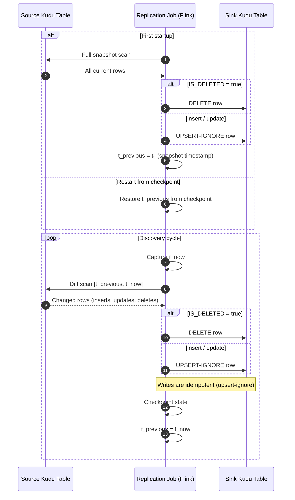

```mermaid
sequenceDiagram
    autonumber
    participant S as Source Kudu Table
    participant J as Replication Job (Flink)
    participant K as Sink Kudu Table

    alt First startup
        J->>S: Full snapshot scan
        S-->>J: All current rows
        alt IS_DELETED = true
            J->>K: DELETE row
        else insert / update
            J->>K: UPSERT-IGNORE row
        end
        J->>J: t_previous = t₀ (snapshot timestamp)
    else Restart from checkpoint
        J->>J: Restore t_previous from checkpoint
    end

    loop Discovery cycle
        J->>J: Capture t_now
        J->>S: Diff scan [t_previous, t_now]
        S-->>J: Changed rows (inserts, updates, deletes)
        alt IS_DELETED = true
            J->>K: DELETE row
        else insert / update
            J->>K: UPSERT-IGNORE row
        end
        Note over J,K: Writes are idempotent (upsert-ignore)
        J->>J: Checkpoint state
        J->>J: t_previous = t_now
    end
```
